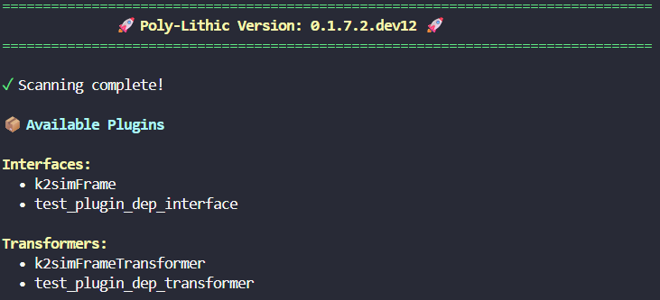

## Plugin API

Poly-Lithic uses a plugin system that allows you to extend functionality by creating custom interfaces, transformers, and model getters. Plugins are automatically discovered via Python entry points.

### Creating a Plugin Project

Use the CLI tool to scaffold a new plugin project:

```bash
pl plugin init --name my_plugin
```

Or interactively (will prompt for details):

```bash
pl plugin init
```

This creates a plugin project structure:

```
my_plugin/
├── my_plugin/
│   ├── __init__.py
│   └── plugins.py          # Your plugin implementations
├── tests/
│   ├── __init__.py
│   └── test_plugins.py     # Unit tests, don't work for the template!
├── .gitignore
├── pyproject.toml          # Entry points pre-configured
└── test_deployment.yaml    # Sample deployment config
```

#### `pl plugin init` Options

| Option | Short | Description | Default |
|--------|-------|-------------|---------|
| `--name` | `-n` | Plugin name | (prompted) |
| `--author` | `-a` | Author name | (prompted) |
| `--email` | | Author email | example@email.com |
| `--description` | `-d` | Short description | (prompted) |
| `--output-dir` | `-o` | Output directory | . |
| `--no-prompt` | | Skip interactive prompts | |

**Examples:**

```bash
# Interactive mode
pl plugin init

# Non-interactive with options
pl plugin init -n rest_interface -a "Jane Doe" -d "REST API interface" --no-prompt

# Specify output directory
pl plugin init -n kafka_plugin -o ./plugins/
```

### Installing Your Plugin

```bash
cd my_plugin

pip install -e .

# or with uv

uv pip install -e .
```

The plugins will now be discoverable by Poly-Lithic. This is facilitated via Python entry points defined in `pyproject.toml` of the plugin.

### Listing Available Plugins

```bash
pl plugin list
```


Show and filter by type:

```bash
pl plugin list --type interface
pl plugin list --type transformer
pl plugin list --type model_getter
```

### Getting Plugin Information

```bash
pl plugin info <plugin_name>
```

This data is obtained from the plugin's Classes docstring.

### Using Plugins in Configuration

Once installed, reference your plugin using the `type` field:

```yaml
modules:
  my_interface:
    name: "my_interface"
    type: "interface.my_plugin_interface"  # Matches entry point name
    pub: "output_topic"
    sub:
      - "input_topic"
    config:
      option1: "value1"
      option2: "value2"
```

### Available Entry Point Groups

| Group | Base Class | Purpose |
|-------|------------|---------|
| `poly_lithic.interfaces` | `BaseInterface` | External system communication (EPICS, REST, etc.) |
| `poly_lithic.transformers` | `BaseTransformer` | Data transformation and processing, may also be used for hardcoded models. |
| `poly_lithic.model_getters` | `ModelGetterBase` | Model loading (MLFlow, local files) |

### Deciding Which Plugin Type to Use

The `transformer` and the `model_getter` plugin types can sometimes overlap. Here are some guidelines:
- **Use a `model_getter`** when your plugin's primary purpose is to load or retrieve models from a specific source (e.g., MLFlow, local files, databases). The `model_getter` should focus on the logic of accessing and loading the model. `model_getter` is triggered by simply passing data through to the models exposed `.evaluate()` method in the main program flow.

- **Use a `transformer`** when your plugin is primarily focused on processing or transforming data, even if it involves using a model. If your plugin applies a model to input data to produce output, it should be a `transformer`.`transformer` is called by its `.update()` method in the main program flow. The output is only taken when the transformer sets its internal `updated` flag to `True`. This is then reset when the data is consumed downstream. This is done to facilitate only passing data when needed, e.g., for rate-limiting or collecting multiple inputs before producing an output.

These will fire under different circumstances in the Poly-Lithic data flow, so choose based on where your functionality fits best.

> [!CAUTION]
> ModelGetter loading of plugins needs a little more testing but should be functional as part of the next tagged release.


