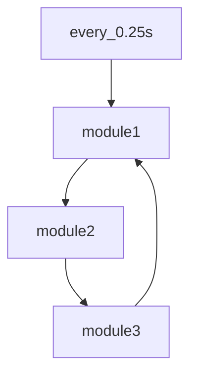
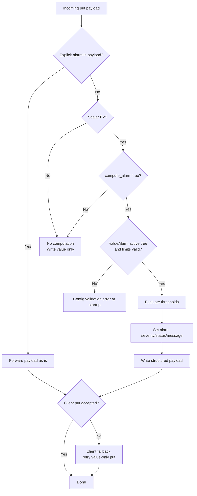

<!-- NEW DOCS in progress
use old docs in the meantime: [old docs](./readme_old.md) -->


[](https://github.com/ISISNeutronMuon/poly-lithic/actions/workflows/main.yml)

[](https://github.com/ISISNeutronMuon/poly-lithic/actions/workflows/docker-build.yml)

[](https://github.com/ISISNeutronMuon/poly-lithic/actions/workflows/docs.yml)


# Table of Contents
  - [Installation](#installation)
  - [Usage](#usage)
  - [Configuration file](#configuration-file-formerly-pv_mappings-files)
  - [Plugin API](#plugin-api)
  - [Modules](#modules)
    - [Interface](#interface)
      - [Interface Configs](#interface-configs)
        - [p4p sample configuration](#p4p-sample-configuration)
        - [p4p_server sample configuration](#p4p_server-sample-configuration)
        - [k2eg sample configuration](#k2eg-sample-configuration)
        - [fastapi_server sample configuration](#fastapi_server-sample-configuration)
          - [REST API Endpoints](#rest-api-endpoints)
          - [Job Lifecycle & Tracking](#job-lifecycle--tracking)
    - [Transformer](#transformer)
      - [Transformer Configs](#transformer-configs)
        - [SimpleTransformer sample configuration](#simpletransformer-sample-configuration)
        - [CAImageTransformer sample configuration](#caimagetransformer-sample-configuration)
        - [CompoundTransformer sample configuration](#compoundtransformer-sample-configuration)
        - [PassThroughTransformer sample configuration](#passthroughtransformer-sample-configuration)
    - [Model](#model)
      - [Model Configs](#model-configs)
        - [Example Model - Local Model](#example-model---local-model)
        - [Example Model - MLFLow Model](#example-model---mlflow-model)

  - [Roadmap](#roadmap)
# Poly-Lithic

Poly-Lithic is a package that allows you do deploy any model with an arbitrary number of inputs and outputs, related data transformations and system interfaces. 

Each deployment is defined by a model, typically hosted and retrieved from [MLFlow](https://mlflow.org/) and YAML file that describes the DG (Directed Graph) of model, transformations and interfaces. There are no restrictions on the numbers and types of nodes in the graph, so it may be used for things other than ML models.


## Installation

Python `3.11.x` recommended.

```bash
pip install poly-lithic
```
for development:

```bash
pip install -r reqirements.txt
pip install -e .
```

Alternatively with uv:

```bash
uv pip install poly-lithic
```

for development with uv:
```bash
uv pip install -r requirements.txt
uv pip install -e .
```

with docker:

```bash
docker compose -f ./docker/docker_compose.yml up
``` 

## Usage

```python
model_manager run --publish -c ./tests/pv_mapping_mlflow.yaml -e ./tests/env.json
```
or
```python
pl run --publish -c ./tests/pv_mapping_mlflow.yaml -e ./tests/env.json
```
The env file is a json file that contains the environment variables that are used in the deployment. In this example we are pulling the [torch](./examples/torch_and_generic.ipynb) model and wrapping it with simple transformers and a simple p4p server.  

Reqired variables are:
- `AWS_ACCESS_KEY_ID`
- `AWS_SECRET`
- `AWS_DEFAULT_REGION`
- `AWS_REGION`
- `MLFLOW_S3_ENDPOINT_URL`
- `MINIO_ROOT_PASSWORD`
- `MINIO_ROOT_USER`
- `MINIO_SITE_REGION`
- `MLFLOW_TRACKING_URI` 
- `PUBLISH` - set to `true` for the deployment to publish data to the interface. This flag serves as a safety measure to prevent accidental publishing of data to live system. 

See [this](https://mlflow.org/docs/latest/api_reference/python_api/mlflow.environment_variables.html) for explantions of the MLFlow environment variables.

## Configuration file (formerly pv_mappings files)

The configuration file consists of 2 sections `deployment` and `modules`. Former describes deployment type and other setings such as refresh rate. The latter describes the nodes the modules and their connections to each other. 


#### Example configuration file
```yaml
deployment:
  type: "continuous" #type of deployment, continuous is the only one supported at the moment but more will be added
  rate: 0.25 #refresh rate in seconds

modules:
    module1:
        name: "module1"         # name of the module used to identify it in the graph
        type: "type.subtype"    # type of the module, used to identify the module class and subclass 
        pub: "topic1"           # topic the outputs will be published to, similar to MQTT, Kafka, ROS etc 
        sub:                    # topics the module will subscribe to, we listen for and transform data from these topics
        - "update"              # update is a special topic that will trigger an interface module to run get_all method (get_many for all keys)
        - "topic3"              
        module_args: None       # defines what arguments to pass to the module observer, if any this can inform unpacking etc
        config:                 # configuration specific to the module type
            key1: "value1"
            keyn: "valuen"

    module2:
        ...
        pub: "topic2"
        sub:
        - "topic1"
    module3:
        ...
        pub: "topic3"
        sub:
        - "topic2"
```
The graph for the above configuration would look like this:



Under the hood we are passing messages in the format:

```json
{
    "topic": "topic1",
    "data": {
        "key1": {"value" : 1},
        "key2": {"value" : [1,2,3]},
        "key3": {"value" : {...}}
    }
}
```
Note that the data is a dictionary of dictionaries.

## Plugin API 

Read more in the [plugin readme](./poly_lithic/templates/plugin/README.md).


## Modules

### Interface
Interface modules are used to interact with external data, usually an accelerators control systems but can be anything. They follow the following structure (see [base interface class](./poly-lithic/src/interfaces/BaseInterface.py)):

```python
class BaseInterface(ABC):
    @abstractmethod
    def __init__(self, config):
        pass

    @abstractmethod
    def monitor(self, name, handler, **kwargs): # not used at the moment but will be used to monitor the interface for changes, rather than polling when p4p can monitor more than 4 pv's
        pass

    @abstractmethod
    def get(self, name, **kwargs):              # get a value from the interface
        pass

    @abstractmethod
    def put(self, name, value, **kwargs):       # put a value to the interface
        pass

    @abstractmethod
    def put_many(self, data, **kwargs):         # put many values to the interface
        pass

    @abstractmethod
    def get_many(self, data, **kwargs):         # get many values from the interface
        pass
```
All values are expected to come in as dictionaries of dictionaries with the following format:

```python
# for sigular puts and gets
name = "key1"
value = {"value" : 1, "timestamp": 1234567890, "metadata": "some meta data"}        # note tha the timestamp and metadata are optional and unusued at the moment

# for _many 
data = {
    "key1": {"value" : 1, "timestamp": 1234567890, "metadata": "some meta data"},
    "key2": {"value" : [1,2,3]},
    "key3": {"value" : {...}}
}
```
#### Interface Configs
| Module | Description | YAML configuration | 
| ------ | ----------- | ------------------ | 
| `p4p` | EPICS data source, must have an external EPICS server running. Note that SoftIOCPVA will not work with this module. | [config](#p4p-sample-configuration) |
| `p4p_server` | EPICS data source, host EPICS p4p server for specifed PVs | same [config](#p4p-sample-configuration) as `p4p`|
| `k2eg` | Kafka to EPICS gateway, get data from Kafka and write it to EPICS | [config](#k2eg-sample-configuration) |
| `fastapi_server` | HTTP/REST interface with job queue for request-response model inference | [config](#fastapi_server-sample-configuration) |

##### `p4p` sample configuration
```yaml
deployment:
    ...
modules:
    mymodule:
    ...
    config: 
      EPICS_PVA_NAME_SERVERS: "epics.server.co.uk:5075"
      # other EPICS_CONFIGS can go here
      variables:
        MY_VAR:TEST_A:
          proto: pva
          name: MY_VAR:TEST_A # name here is redundant as the name is the key in the variables dictionary, it will be removed in future versions
        MY_VAR:TEST_B:
          proto: pva
          name: MY_VAR:TEST_B
        MY_VAR:TEST_S:
          proto: pva
          name: MY_VAR:TEST_S
          # default: 0 | [0.0, ... ,0.0] | no defaults for images   optional
          # type: scalar | waverform | image (default scalar)       optional
          # compute_alarm: true|false (default false)                optional
          # display/control/valueAlarm: native NTScalar metadata     optional
```

##### `p4p_server` sample configuration
```yaml
    config: 
      EPICS_PVA_NAME_SERVERS: "epics.server.co.uk:5075"
      # other EPICS_CONFIGS can go here
      variables:
        MY_VAR:TEST_A:
          proto: pva
          name: MY_VAR:TEST_A
        MY_VAR:TEST_B:
          proto: pva
          name: MY_VAR:TEST_B
        MY_VAR:TEST_S:
          proto: pva
          name: MY_VAR:TEST_S
          # default: 0 | [0.0, ... ,0.0] | no defaults for images   optional
          # type: scalar | waverform | image (default scalar)       optional
          # compute_alarm: true|false (default false)                optional
          # display/control/valueAlarm: native NTScalar metadata     optional
```
Yes, it is identical to p4p, the only difference is that the p4p server will host the PVs for the specified variables.

###### Alarm config for `p4p` / `p4p_server`

Scalar PVs can compute EPICS alarm fields from ``valueAlarm`` limits:

- ``compute_alarm`` (bool, default ``false``)
- ``display`` (optional): ``limitLow``, ``limitHigh``, ``description``, ``format``, ``units``
- ``control`` (optional): ``limitLow``, ``limitHigh``, ``minStep``
- ``valueAlarm`` (optional native NT block)

When ``compute_alarm: true``:

- ``valueAlarm.active`` must be ``true``
- required limits: ``lowAlarmLimit``, ``lowWarningLimit``, ``highWarningLimit``, ``highAlarmLimit``
- optional severities default to:
  ``lowAlarmSeverity=2``, ``lowWarningSeverity=1``, ``highWarningSeverity=1``, ``highAlarmSeverity=2``

Status mapping follows EPICS ``menuAlarmStat``:
``NO_ALARM=0``, ``HIHI=3``, ``HIGH=4``, ``LOLO=5``, ``LOW=6``.

Notes:

- Non-scalar PVs do not compute alarms.
- Non-scalar and scalar PVs may still pass explicit ``alarm`` payloads manually.
- Explicit ``alarm`` payload always overrides computed alarm.
- ``p4p`` client attempts structured put first; if the server rejects it, it retries with value-only put.

###### Alarm evaluation flow



###### Model-side alarm override

The model may override alarm fields by returning structured output:

```python
return {
    "ML:LOCAL:TEST_S": {
        "value": output_value,
        "alarm": {"severity": 2, "status": 3, "message": "HIHI (model override)"},
    }
}
```

This is supported by ``ModelObserver`` and passed through to interfaces.
In ``examples/base/local/deployment_config_p4p_alarm.yaml`` this now goes through an
``output_transformer`` direct-symbol mapping (``ML:LOCAL:TEST_S -> ML:LOCAL:TEST_S``),
which preserves ``alarm`` and other non-``value`` fields.
See runnable example:

- config: ``examples/base/local/deployment_config_p4p_alarm.yaml``
- model: ``examples/base/local/model_definition_alarm_override.py``

#### `k2eg` Sample configuration

This module is built on top of SLAC's [k2eg](https://github.com/slaclab/k2eg), it's great because it allows you get data from `pva` and `ca` protocols over Kafka. currently its the only interface that supports `ca` protocol.

```yaml
input_data:
  get_method: "k2eg"
  config:
    variables:
      MY_VAR:TEST_A:
        proto: ca # supports ca or pva
        name: MY_VAR:TEST_A
      MY_VAR:TEST_B:
        proto: pva
        name: MY_VAR:TEST_B
```

##### `fastapi_server` sample configuration

The `fastapi_server` interface exposes a REST API for submitting inference jobs and retrieving results. It manages an internal job queue and variable store, and embeds a uvicorn server.

> Warning: `fastapi_server` is experimental and may change or be removed without notice.

###### Config fields

| Field | Type | Default | Description |
| ----- | ---- | ------- | ----------- |
| `name` | string | `"fastapi_server"` | Display name |
| `host` | string | `"127.0.0.1"` | Bind address |
| `port` | int | `8000` | Bind port |
| `start_server` | bool | `true` | Whether to launch embedded uvicorn |
| `wait_for_server_start` | bool | `false` | Block until server is accepting connections |
| `startup_timeout_s` | float | `2.0` | Max wait for startup |
| `input_queue_max` | int | `1000` | Max queued jobs before rejecting (HTTP 429) |
| `output_queue_max` | int | `1000` | Max completed jobs before oldest is evicted |
| `cors_origins` | list\[string\] | `[]` | CORS allow-origins (empty = no CORS middleware) |
| `variables` | dict | **required** | Variable definitions (see below) |

###### Variable fields

| Field | Type | Default | Description |
| ----- | ---- | ------- | ----------- |
| `mode` | string | `"inout"` | `in`, `out`, or `inout` |
| `type` | string | `"scalar"` | `scalar`, `waveform`, `array`, or `image` |
| `default` | any | `0.0` / zeros | Initial value (not supported for `image` type) |
| `length` | int | `10` | Array/waveform length when no default is provided |
| `image_size` | dict | — | Required for `image` type: `{"x": int, "y": int}` |

###### Example YAML

```yaml
modules:
  my_fastapi:
    name: "my_fastapi"
    type: "interface.fastapi_server"
    pub: "in_interface"
    sub:
      - "get_all"
      - "out_transformer"
    config:
      name: "my_fastapi_interface"
      host: "127.0.0.1"
      port: 8000
      start_server: true
      input_queue_max: 1000
      output_queue_max: 1000
      cors_origins:
        - "http://localhost:3000"
      variables:
        MY_INPUT_A:
          mode: in
          type: scalar
          default: 0.0
        MY_INPUT_B:
          mode: in
          type: array
          default: [1, 2, 3, 4, 5]
        MY_IMAGE_IN:
          mode: in
          type: image
          image_size:
            x: 128
            y: 64
        MY_OUTPUT:
          mode: out
          type: scalar
          default: 0.0
```
###### Runnable config (array/waveform)

For a full runnable config that includes `array` and `waveform` variables, see
[examples/base/local/deployment_config_fastapi_array_waveform.yaml](examples/base/local/deployment_config_fastapi_array_waveform.yaml).

Run it with:

```bash
pl run --publish -c examples/base/local/deployment_config_fastapi_array_waveform.yaml
```

Sample curl commands for the runnable config:

```bash
curl http://127.0.0.1:8000/health

curl -X POST http://127.0.0.1:8000/submit \
  -H 'Content-Type: application/json' \
  -d '{"job_id":"job-001","variables":{"ML:LOCAL:WAVEFORM_IN":{"value":[1,2,3,4,5,6,7,8]},"ML:LOCAL:ARRAY_IN":{"value":[10,11,12,13]},"ML:LOCAL:TEST_A":{"value":1.23},"ML:LOCAL:TEST_B":{"value":4.56}}}'

curl -X POST http://127.0.0.1:8000/get \
  -H 'Content-Type: application/json' \
  -d '{"variables":["ML:LOCAL:WAVEFORM_IN","ML:LOCAL:ARRAY_IN","ML:LOCAL:TEST_S","ML:LOCAL:WAVEFORM_OUT"]}'

curl http://127.0.0.1:8000/jobs/next

curl http://127.0.0.1:8000/jobs/job-001
```

###### REST API Endpoints

| Method | Path | Description |
| ------ | ---- | ----------- |
| `GET` | `/health` | Health check — returns `{"status": "ok", "type": "interface.fastapi_server"}` |
| `GET` | `/settings` | Variable metadata, queue limits, and route table |
| `POST` | `/submit` | Submit a single inference job |
| `POST` | `/get` | Read current variable values |
| `POST` | `/jobs` | Submit a batch of jobs |
| `GET` | `/jobs/next` | Dequeue the next completed job |
| `GET` | `/jobs/{job_id}` | Get the status of a specific job |

**Submit request body:**
```json
{
  "job_id": "optional-custom-id",
  "variables": {
    "MY_INPUT_A": {"value": 3.14},
    "MY_INPUT_B": {"value": [10, 20, 30, 40, 50]}
  }
}
```

**Job snapshot response (from `/jobs/next` or `/jobs/{job_id}`):**
```json
{
  "job_id": "uuid",
  "status": "completed",
  "submitted_at": 1707600000.0,
  "started_at": 1707600001.0,
  "completed_at": 1707600002.0,
  "error": null,
  "inputs": {"MY_INPUT_A": {"value": 3.14}},
  "outputs": {"MY_OUTPUT": {"value": 42.0}}
}
```

**Error codes:**

| Code | Condition |
| ---- | --------- |
| 403 | Write to a read-only variable (`mode: out`) |
| 404 | Unknown variable name, unknown job ID, or no completed jobs for `/jobs/next` |
| 409 | Duplicate job ID |
| 422 | Type validation failure (e.g. wrong shape, non-numeric value) |
| 429 | Input queue full |

###### Job Lifecycle & Tracking

Jobs submitted via `/submit` or `/jobs` follow this lifecycle:

```
submit → queued → running → completed
```

1. **Queued** — the job is validated and placed in the input queue.
2. **Running** — on each clock tick, **one** queued job is transitioned to running and its input values are loaded into the variable store for the pipeline to process.
3. **Completed** — when the pipeline writes results back via `put_many`, the oldest running job is marked as completed and its outputs are recorded.

Completed jobs can be retrieved via `GET /jobs/next` (FIFO dequeue) or `GET /jobs/{job_id}` (by ID).

> [!NOTE]
> **Current tracking limitation (Stage 1 / v1.7.3+):**
> Job tracking is currently **approximated using FIFO ordering**. The pipeline's transformers strip message metadata, so the `job_id` is typically not propagated through to `put_many`. Instead, the system uses a FIFO fallback: when results arrive, the **oldest running job** is assumed to be the one that completed. To enforce this assumption, the clock-driven path transitions only **one queued job per tick** to running state.
>
> This approach is reliable for single-job-at-a-time workloads but does not support true concurrent job tracking.
>
> **Planned improvement (Stage 2 / v1.8+):**
> Proper job tracking will be integrated via trace propagation across the message broker. Each job's `job_id` will be carried through the full pipeline in struct metadata, enabling accurate matching of results to jobs even under concurrent load.

### Transformer

Transformers are used to transform data from one format to another, they can be used to perform some data processing, aggregation or any other transformation action. They follow the structure (see [base transformer class](./poly-lithic/src/transformers/BaseTransformer.py)):

```python
class BaseTransformer:
    @abstractmethod
    def __init__(self, config: dict):
        """
        config: dict passed from the pv_mappings.yaml files.
        """
        pass

    @abstractmethod
    def transform(self):
        """
        Call transform function to transform the input data, see SimpleTransformer in model_manager/src/transformers/BaseTransformers.py for an example.
        """
        pass

    @abstractmethod
    def handler(self, pv_name: str, value: dict | float | int):
        """
        Handler function to handle the input data, in most cases it initiates the transform function when all the input data is available.
        Handler is the only function exposed to the main loop of the program aside from initial configuration.
        """
        pass
```
#### Transformer Configs
| Module | Description | YAML configuration |
| ------ | ----------- | ------------------ |
| `SimpleTransformer` | Simple transformer that can be used to transform scalar values (ca or pv values that have a `value` field) | [config](#simpletransformer-sample-configuration) |
| `CAImageTransformer` | Transformer that can be used to transform a triplet of an array, x and y ca values into a np array | [config](#caimagetransformer-sample-configuration) |
| `CompoundTransformer` | Compound transformer that can be used to have multiple transformers in parallel | [config](#compoundtransformer-sample-configuration) |
| `PassThroughTransformer` | Transformer that can be used to pass data through without any transformation other than the tag | [config](#passthroughtransformer-sample-configuration) |

##### `SimpleTransformer` Sample configuration
```yaml
modules:
  input_transformer:
    name: "input_transformer"
    type: "transformer.SimpleTransformer"
    pub: "model_input"
    sub:
    - "system_input"
    module_args: None
    config:
      symbols:
        - "LUME:MLFLOW:TEST_B"
        - "LUME:MLFLOW:TEST_A"
      variables:
        x2:
          formula: "LUME:MLFLOW:TEST_B"
        x1: 
          formula: "LUME:MLFLOW:TEST_A"
```

##### `CAImageTransformer` Sample configuration
```yaml
modules:
  image_transformer:
    name: "image_transformer"
    type: "transformer.CAImageTransformer"
    pub: "model_input"
    sub:
    - "update"
    module_args: None
    config:
      variables:
        img_1:
          img_ch: "MY_TEST_CA"
          img_x_ch: "MY_TEST_CA_X"
          img_y_ch: "MY_TEST_CA_Y"
        img_2:
          img_ch: "MY_TEST_C2"
          img_x_ch: "MY_TEST_CA_X2"
          img_y_ch: "MY_TEST_CA_Y2"
```

##### `PassThroughTransformer` Sample configuration
```yaml
modules:
  output_transformer:
    name: "output_transformer"
    type: "transformer.PassThroughTransformer"
    pub: "system_output"
    sub:
    - "model_output"
    module_args: None
    config:
      variables:
        LUME:MLFLOW:TEST_IMAGE: "y_img"
```
##### `CompoundTransformer` Sample configuration
> [!CAUTION]
> This module will be deprecated in the future, pub-sub model means that compound transformers are no longer needed.

```yaml
modules:
  compound_transformer:
    name: "compound_transformer"
    type: "transformer.CompoundTransformer"
    pub: "model_input"
    sub:
    - "update"
    module_args: None
    config:
      transformers:
        transformer_1:
          type: "SimpleTransformer"
          config:
            symbols:
              - "MY_TEST_A"
              - "MY_TEST_B"
            variables:
              x2:
                formula: "MY_TEST_A*2"
              x1: 
                formula: "MY_TEST_B+MY_TEST_A"
        transformer_2:
          type: "CAImageTransformer"
          config:
            variables:
              img_1:
                img_ch: "MY_TEST_CA"
                img_x_ch: "MY_TEST_CA_X"
                img_y_ch: "MY_TEST_CA_Y"
              img_2:
                img_ch: "MY_TEST_C2"
                img_x_ch: "MY_TEST_CA_X2"
                img_y_ch: "MY_TEST_CA_Y2"
```


### Model

Models are the core of the deployment, they can be retrieved locally or from MLFlow and accept data in form of dictionries. By deafault models pivot the dictionry or rather remove the additional keys from messages to simplify the data structure that the model has to process.

All models have to implement the `evaluate` method that takes a dictionary of inputs and returns a dictionary of outputs. 

#### Model Config 

```yaml
model:                              # this is the name of the model module, it is used to identify the model in the graph
    name: "model"                   # name of the model used to identify it in the graph, overrides the name in the module section
    type: "model.SimpleModel"       # type of module, used to identify the model class and subclass, in this case we are saying it a model 
    pub: "model"                    # where the model will publish its outputs, this is the topic that the model will publish to
    sub: "in_transformer"           # topic that the model will subscribe to, this is the topic that the model will listen for inputs
    module_args: None               # defines what arguments to pass to the model observer, if any this can inform unpacking etc
    config:
      type: "modelGetter"           # defines the type of model getter, this is used to identify the model getter class
      args:                         # arguments to pass to the model getter class, in this case we are passing the path to the model definition file

```
See the following examples for usage


###### Example Model - Local Model

```python
  
class SimpleModel(torch.nn.Module):
    def __init__(self):
        super(SimpleModel, self).__init__()
        self.linear1 = torch.nn.Linear(2, 10)
        self.linear2 = torch.nn.Linear(10, 1)

    def forward(self, x): # this is for our benefit, it is not used by poly-lithic
        x = torch.relu(self.linear1(x))
        x = self.linear2(x)
        return x

    # this method is necessary for the model to be evaluated by poly-lithic
    def evaluate(self, x: dict) -> dict:
        # x will be a dicrt of keys and values
        # {"x": x, "y": y}
        input_tensor = torch.tensor([x['x'], x['y']], dtype=torch.float32)
        # you may want to do somethinf more complex here
        output_tensor = self.forward(input_tensor)
        # return a dictionary of keys and values
        return {'output': output_tensor.item()}
  ```

  Lets say we want to retreive the model locally, we need to specify a factory class:

```python
  
class ModelFactory:
    # can do more complex things here but we will just load the model from a locally saved file
    def __init__(self):
        # add this path to python environment
        os.environ['PYTHONPATH'] = os.path.abspath(
            os.path.join(os.path.dirname(__file__), '..', '..', '..')
        )
        print('PYTHONPATH set to:', os.environ['PYTHONPATH'])
        self.model = SimpleModel()
        model_path = 'examples/base/local/model.pth'
        if os.path.exists(model_path):
            self.model.load_state_dict(torch.load(model_path))
            print('Model loaded successfully.')
        else:
            print(
                f"Warning: Model file '{model_path}' not found. Using untrained model."
            )
        print('ModelFactory initialized')

    # this method is necessary for the model to be retrieved by poly-lithic
    def get_model(self):
        return self.model
```
The in the config file:

```yaml
...
model:
    name: "model"
    type: "model.SimpleModel"
    pub: "model"
    sub: "in_transformer"
    module_args: None
    config:
      type: "LocalModelGetter"
      args: 
        model_path: "examples/base/local/model_definition.py"           # path to the model definition
        model_factory_class: "ModelFactory"                             # class that you use to create the model
      variables:
        max:
          type: "scalar"
...
```

Then to run the model:
```bash
pl --publish -c examples/base/local/deployment_config.yaml
```
See the [local example notebook](./examples/base/simple_model_local.ipynb) for more details.

#### Example Model - MLFLow Model
See the [MLFlow example notebook](./examples/base/simple_model_mlflow.ipynb) for more details.


## Roadmap

| Feature / Task                                | Timeline     | Priority | Status        |
|-----------------------------------------------|--------------|----------|---------------|
| 🖌️ 🎨 **Make logo**                            | 1–3 Months   | 🥇       | Compelte! |
| 🔌 🧩 **Plugin System for Modules**                      | 1–3 Months   | 🥇       | Complete! |
| 🧠 🔧 **Lume-Model Integration**               | 1–3 Months   | 🥇       | 🚧 In Progress |
| ⚡ 🔄 **Event driven mode**                    | 1-3 Months   | 🥈       | 🚧 In Progress     |
| 🌐 🔌 **FastAPI REST Interface**                | 1–3 Months   | 🥇       | ✅ Complete |
| 🔗 📡 **Job trace propagation across broker**   | 1–1 Months   | 🥈       | ⏳ Planned     |
| 📦 🤖 **MLflow 3.x Support**                   | 6–12 Months   | 🥇       | ⏳ Planned     |
| 🌐 🚀 **Move to `gh-pages`**                   | 1–3 Months   | 🥈       | 🚧 In Progress |
| 🔗 🧪 **p4p4isis Interface**                   | 6–12 Months  | 🥉       | ⏳ Planned     |
| 📊 🧭 **Time Series Aggregation**              | 3–6 Months   | 🥉       | ⏳ Planned     |
| 📈 🔍 **Model Evaluator Module**               | 3–6 Months   | 🥉       | ⏳ Planned     |
| 🔁 🔧 **Model Retrainer Module**               | 6–12 Months  | 🥈       | ⏳ Planned     |
